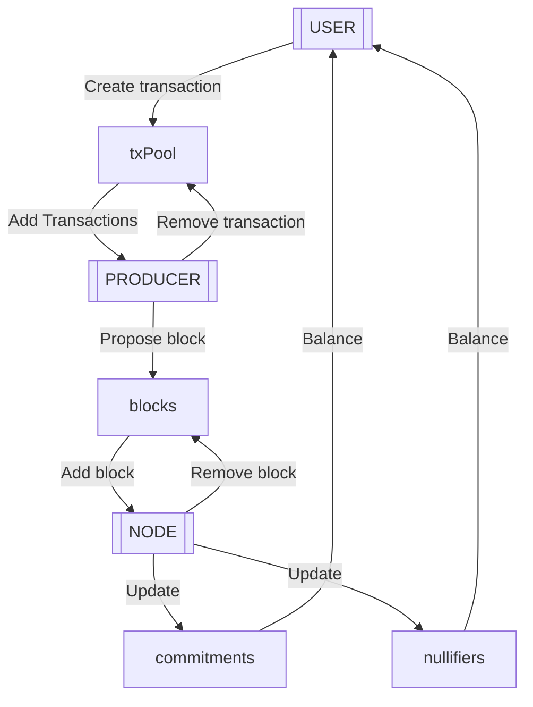

# Zcash Succint Protocol

This project models a theoretical **succinct version of the Zcash blockchain**, abstracting several components to achieve the following goals:

- **Constant storage** efficiency for all parties, regardless of the number of transactions or blocks.
- **Full privacy** using Zcash Orchard technology for transactions and efficient ZK-SNARK proofs.
- **Non-auditability**, focusing solely on the current state by using Merkle tree compact representations to store commitments and nullifiers.
- **Abstract consensus mechanism**, with the focus on transaction verification and state updates.

## The protocol

The protocol consists of three processes:

- **User:**
    - Create transactions. 
    - Sends transactions to the transaction pool.
- **Producer:**
    - Gathers transactions from the transaction pool. 
    - Proposes blocks.
- **Node:**
    - Verifies proposed blocks.
    - Updates commitments and nullifiers.
    - Discards the block after processing.

### Specification

The [specification](protocol.tla) is implemented as a PlusCal algorithm with accompanying TLA+ [definitions](definitions.tla). A [PDF]((protocol.pdf)) version of the specification is also available.

The number of states in the model grows as more users are added in the [configuration](protocol.cfg). For a single user, the number of states equals the number of labels in the processes (`CreateTx`, `Mine`, and `Verify`), plus the `Init` and `Terminating` states generated by the model checker.

## Protocol theorems

The goal is to formally prove properties of the protocol. Some properties are proven using TLA temporal logic and checked by TLC, other properties are classical text proofs.

### Liveness

- `HeightAlwaysIncreases`

### Safety

- `NoDoubleSpending`

### Transactions

- `TransactionsEventuallyProcessed`

### Balances

**Property:** Users can independently retrieve their balances by querying the node and using their private keys. This process relies on the `noteCommitmentProof` and `nullifierProof` shared states to verify the inclusion and spent status of their notes.

**Proof:**

- Identifying Notes:
    - Each note commitment is derived using the user's public key.
    - The user queries the node for commitments associated with their public key.
    - The node provides commitments and a zk-SNARK proof validating their inclusion in the `noteCommitmentProof`.

- Verifying Spent Status:
    - The user computes nullifiers for their notes.
    - The user queries the node for nullifiers' inclusion in the `nullifierProof`.
    - The node provides a zk-SNARK proof verifying which nullifiers are spent.

- Computing Balance:
    - The user sums the values of all unspent notes identified through these proofs.

### Storage

**Property:** The storage required for the node is constant over time.

**Proof:**

- Nodes discard proposed blocks after processing. At any given time, the storage required for proposed blocks is `O(MAX_BLOCK_SIZE)`.
- The blockchain maintains:
    - `tip_block`: Requires `O(MAX_BLOCK_SIZE)`.
    - `noteCommitmentProof` and `nullifierProof`: Fixed-size proofs, requiring `O(PROOF_SIZE)` each.
- Total storage complexity for the node is: `O(MAX_B​LOCK_S​IZE×2)+O(PROOF_S​IZE×2)`.

This is constant regardless of the number of transactions or blocks.

### Non-auditable

**Property:** The protocol enables limited auditability, allowing users to audit their own balances and transaction history using their private keys, but prevents global auditability.

**Proof**:

- Retention of Compact State:
    - The protocol retains only the `noteCommitmentProof` and `nullifierProof`, which summarize the current state of the system.
    - Raw transactions, full Merkle trees, and intermediate states are not stored.
- User-Specific Auditability:
    - Each user can use their private key to:
        - Identify their notes within the commitments summarized by `noteCommitmentProof`.
        - Verify the spent status of these notes using `nullifierProof`.
        - Compute their balance and reconstruct their transaction history based on these proofs.
- No Global Auditability:
    - Without access to the full tree structure or historical transactions, external parties cannot reconstruct the history of the blockchain.
    - The zk-SNARKs ensure that only valid state transitions are recorded, but they reveal no details about the underlying transactions.
