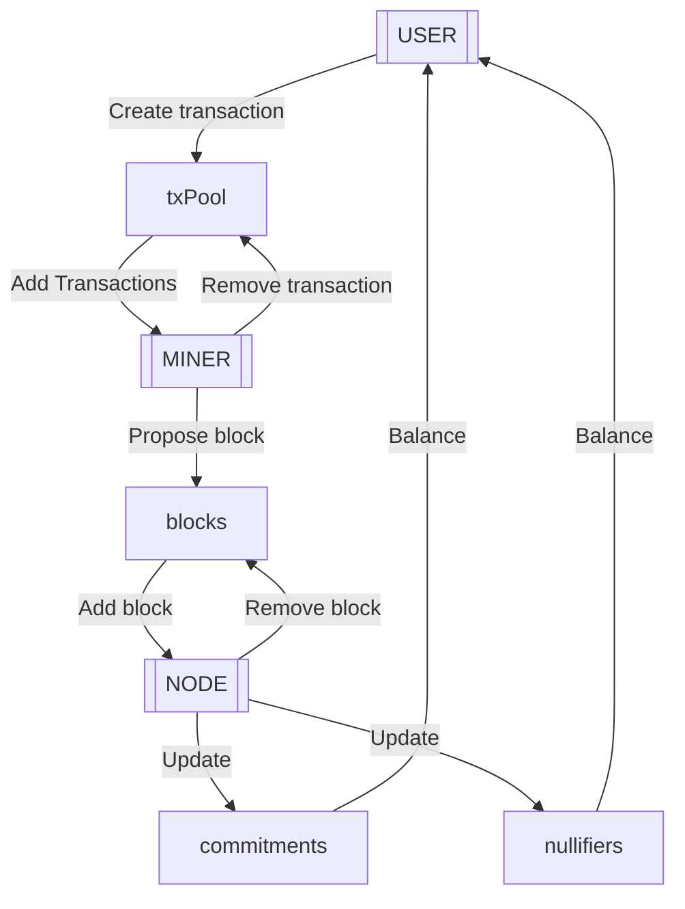

# Zcash Succint Protocol

This project models a theoretical **succinct version of the Zcash blockchain**, abstracting several components to achieve the following goals:

- **Constant storage** efficiency for all parties, regardless of the number of transactions or blocks.
- **Full privacy** using Zcash Orchard technology for transactions.
- **Non-auditability**, focusing solely on the current state by using Merkle tree hashes to store commitments and nullifiers.
- **Abstract consensus mechanism**, with the focus on transaction verification and state updates.

## The protocol

The protocol consists of three processes:

- **User:**
    - Create transactions. 
    - Sends transactions to the transaction pool.
- **Miner:**
    - Gathers transactions from the transaction pool. 
    - Proposes blocks.
- **Node:**
    - Verifies proposed blocks.
    - Updates commitments and nullifiers.
    - Discards the block after processing.

### Specification

The [specification](protocol.tla) is implemented as a PlusCal algorithm with accompanying TLA+ [definitions](definitions.tla). A [PDF]((protocol.pdf)) version of the specification is also available.

The number of states in the model grows as more users are added in the [configuration](protocol.cfg). For a single user, the number of states equals the number of labels in the processes (`CreateTx`, `Mine`, and `Verify`), plus the `Init` and `Terminating` states generated by the model checker.

## Protocol theorems

The goal is to formally prove properties of the protocol. Some properties are proven using TLA temporal logic and checked by TLC, other properties are classical text proofs.

### Liveness

- HeightAlwaysIncreases

### Safety

- Double spending

### Transactions

- TransactionsEventuallyProcessed

### Blocks

### Balance

### Storage

**Property**: The storage required for the node is constant over time.

**Proof:**

- Nodes discard proposed blocks after processing. At any given time, the storage required for proposed blocks is `O(MAX_BLOCK_SIZE)`.
- The blockchain maintains:
    - `tip_block`: Requires `O(MAX_BLOCK_SIZE)`.
    - `noteCommitmentTreeRoot` and `nullifierTreeRoot`: Fixed-size hashes, requiring `O(HASH_SIZE)` each.
- Total storage complexity for the node is: `O(MAX_B​LOCK_S​IZE×2)+O(HASH_S​IZE×2)`.

 This is constant regardless of the number of transactions or blocks.

### Non-auditable

**Property:** The protocol does not retain historical data, making it impossible to audit past transactions.

**Proof**:

- The protocol discards blocks after processing, and only the current state (Merkle tree roots) is retained.
- Historical transaction data is irrecoverable, ensuring non-auditability.
